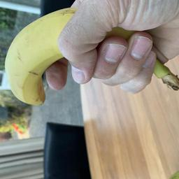
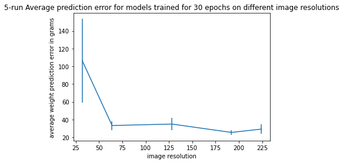
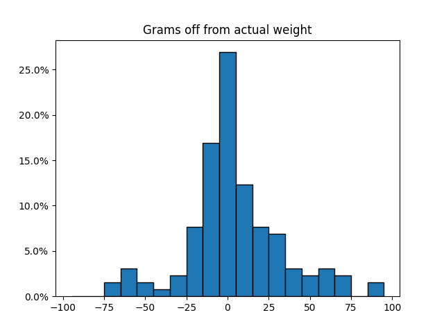

Computer vision nowadays is dominated by deep learning using Convolutional Neural Networks (CNNs), for this project we learn about the usage of CNNs to solve a problem in various ways, from basic classifiers to using multiple networks for a single instance.

# Goals, and our dataset

For the goal of this project we try to create a CNN that can estimate the weight of various classes of fruit, and to try different approaches to find the machine learning model with the highest accuracy for this task.

Our dataset for this problem consists of homemade pictures of fruits. The dataset contains 7 fruit classes, `apple`, `banana`, `kiwi`, `onion`, `tomato`, `orange`, and `mandarin`, for each of these classes we have around 190 square pictures from various angles including different sceneries and images where the fruit is partially obscured. All of the images are labeled with the type of fruit in the picture and the weight of that piece of fruit, a few example of the banana class and a quick table on our dataset are given below.

<span class="note"><b>Quick detail: </b>Originally we forgot to take square images, we cropped them after taking pictures in such a way that as little of the fruit as possible was cut from the images. Normally this would be time consuming, so we created a little program that is publicly available [here](https://github.com/KoenduBuf/tk-imgdecide).</span>

| A banana of 148 grams | A banana of 173 grams | A banana of 188 grams |
| :-------------------: | :-------------------: | :-------------------: |
|  |   |  |

<p></p>

| class    | #Images | #Unique weights |  Weight: min-avg-max |
|:--------:|:-------:|:---------------:|:--------------------:|
| apple    |    195  |    13           |  165 - 188.7 - 206   |
| banana   |    190  |    18           |  139 - 170.2 - 193   |
| kiwi     |    181  |    12           |   84 -  95.1 - 103   |
| onion    |    192  |    17           |   68 - 137.7 - 193   |
| tomato   |    191  |    12           |   71 - 130.3 - 177   |
| orange   |    196  |    16           |  151 - 174.7 - 209   |
| mandarin |    171  |    12           |   96 - 106.2 - 122   |

# Training and test sets

Training our ML models on the whole dataset would be unfair since we can then not test its performance on unseen data. For this reason we divided our dataset into a train set and a test set, where the train set contains 90% of the dataset. The models are only allowed to train on the train set, and evaluated on the unseen test set. Additionally, to fully utilize our training set, we used K-fold cross validation on our training set instead of having a single validation test set.

With the already small dataset, and the split into a train and test set, we have very little data left in the train set for the network to learn from. Our solution to this problem was data augmentation. Specifically any training instance is first turned into 4 separate instances by applying a vertical flip of the image, and then a horizontal flip, both with 50% chance. This strategy already gives a significant amount more unique training instances, 4 times as much to be exact. Finally we randomly remove a section of the image, again with a 50% chance, this gives us more than enough instances to train on, and will remove the chance of over-fitting significantly, and make the model more robust to occlusion. This last approach was based on [this paper](https://arxiv.org/abs/1708.04896).

All of these data transformations are only applied on the training set, this way we serve the real images to the model during testing to get the most accurate real world test results, these images will only have minor things done to them. For the modifications done to all images (train and test sets): we only transform them by resizing them to 224x224, and normalizing their channels to have a mean of ```0.485, 0.456, and 0.406```, while normalizing the standard deviation to ```0.229, 0.224, and 0.225``` respectively unless otherwise specified. These values were chosen as they are the default values for the ResNet model input, and thus are proven to work well.

# Showing results

To judge how good our weight estimators work we will calculate the <span class="tooltip"> 10th, 50th and 90th percentile.
 
 <span class="tooltiptext"><b>Quick reminder:</b> the n-th percentile value means there is a n% chance that the model guess was off by that value or less. </span> </span> of the absolute difference between the real weight and the guessed weight.

We will also visualize the results of each of our approaches in a histogram with consistent bucket sizes throughout this article. For this we chose to set the size of each bucket to 10 grams, with the center bucket being all guess within 5 grams from the actual weight, as this clearly shows a good yet clear visual of the accuracy.

# Comparing dataset image resolution

When trying to understand how a model can predict fruit weight based on a image, it makes sense that the model would use the textures of the fruits to have information about the scale of the fruit in the image. To assess the impact of textures we trained models on datasets of different image resultions (32, 64, 128, 192, 224), since the ResNet18 architecture resizes all images to 224px no higher resolutions were used. An average of absolute prediction error over 5 runs is shown in the graph. On visual inspection it is clear that the lowest resolution has a loss of information needed for the model to discriminate, however for 64px and higher there is no noticeable difference.



# A first test: Fruit classification + weight averages

We made a CNN that classified the images just by their fruit class. For this classifier we tried various network architectures, trained from scratch. The architecture that got the best performance reached a <span class="tooltip"> classification accuracy of 89.5% <span class="tooltiptext">In perspective: random guessing would give a 1/7 = 14% classification accuracy</span> </span>, this result was obtained by using transfer learning on a pre-trained ResNet18 model.

So we can classify fruits, that means that we already have the most simple CNN for weight estimation: we can have our fruit classifier guess the fruit and then take the average weight of that fruit as our weight estimation. While this approach sounds simplistic, it is likely the basis of what any CNN will do. This method resulted in ```2.6```, ```12.8```, and ```55.3``` for the 10th, 50th and 90th percentile of the absolute difference, and of course we also plotted these results below:


# Attempt two: Weight window classifier

Next we tried to train a single CNN to classify the fruits again, but this time we tried to classify them by their weight range. This means that instead of 1 label for each fruit class, <span class="tooltip">we created classes for every N grams<span class="tooltiptext"> So, we have classes 0-N, N-2N, 2N-3N, etc... </span> </span>, the model was then trained to predict the weight class. When testing the estimations of this strategy we took the window range that the classifier gave, and took the average value in that range as the weight guessed by the model. The best result using this approach was again by using transfer learning on a pre-trained ResNet18 model. This approach took slightly longer to train, but did obtain good results, improving over the simple fruit classification strategy.

After some testing we concluded that the best performing bucket size (N) was 2 grams, which gave us ```0.0```, ```7.5```, and ```60.1``` for the 10th, 50th and 90th percentile of the absolute difference, respectively. Getting 0 for the 10th percentile means that we have a 10% chance to estimate the exact right weight, and a 50% chance to be off by 7.5 or less grams is also quite a good score! Again, we also visualize the results of this approach below:


# Another try: Regression on a single model output

We then created a model that output just a single number for the weight of the fruit in the image. The results of this model were worse than the other 2 methods, but not by that much, it obtained a score of ```3.9```, ```24.8```, and ```54.3``` for the 3 percentiles in order, again by using transfer learning on a ResNet18 architecture. These results are also graphed below, where we see visually that it does not do nearly as good as the other 2 models


# Comparing to a common approach: Multiple 1-vs-All classifiers

The ensemble classifier approach (with several <i>1 vs all</i> classifiers) is a common approach for multiclass classification. When starting this project we looked at other approaches to classifying object weight based on image of which most use an ensemble classifier approach. Here we use an ensemble classifier composed of multiple ResNet models which are each trained in <i>1-vs-all</i> configuration with as positive class all images within a fixed range of weights e.g. [5g-10g] and as negative class all other images. With each ResNet model trained to recognize a different range of weights, to predict the class of a new image we pass the image to each ResNet model which returns a prediction if the image is the positive or negative class of that model, then we go over the confidence values of each model that predicted the image as positive and take the corresponding positive class weight range of the model with the highest confidence to determine the weight range that the ensemble model predicts. 

<b>Window Size choice:</b> A single ResNet needs to be trained per weight range, and the amount of models depends on the size of the weight range (the smaller the range the more models are needed to cover all object weights). Futhermore each model needs to train on a dataset with a balanced (stratified) amount of positive and negative samples (otherwise we have a large imbalance and it predicts all input as negative), and to have enough training data the window size needs to be large enough that it contains several instances. Taking these considerations into account, we chose a window size of 5 which still allows for a single fruit type to be spread over multiple windows. For our image dataset which goes from 68 to 209g, this results in <i>round_up((209-68)/5) =</i> <b>29</b> classifiers. The models are trained for 15 epochs.

# Conclusion

When comparing the results of these strategies, we see that
